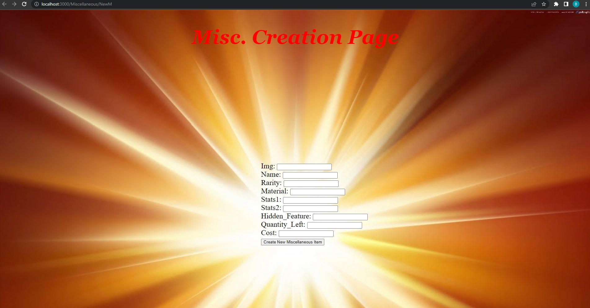

#The Fantasia Store

##About the Project and The Motivation Behind It

This is project 2 based in back-end development. This interacts with the database No-SQL database such as MongoDB.
 As such we are dealing with entry and retrieval of information from databases and routes.

The story behind the creation of this project is that I am much of a fantasy fanatic such as my last project was based on fantasy as well. 
 As such in this manner there will now there be a creation of a store. As such there should always there be 3 things a store should have as such 
 weapons in a fantasy setting, armor to protect yourself, and utilities for any situation, expected or unexpected.

#Video Demonstration

#ScreenShots

#Tech Used

-JavaScript
-CSS
-React
-Express.js
-Node.js
-AWS
-MongoDB

#Build Status
Project is a hosted and deployed via Render and is connected to the GitHub Repository to redeployed on new commits/pushes.

#Getting this project

**Step 1: Clone (or fork) the repository**

Run the following code in your terminal to download the code:

`git clone https://github.com/Bruce-jimenez/project-2_Fantasia-Store.git`

**Step 2: Run NPM Install to install necessary packages**

Then `npm install`

**Step 3: Run NPM Start to locally**

Create your own .env file for the databases

**Step 4: Run the store**
Running this code in the terminal should run everything on its own.
`Nodemon`

#How to Use
To First Access any of the first pages it would be localhost:3000/
Then which every database which you want to access, such as (Armor, Miscellaneous, or Weapons) just add it exactly after the `localhost:3000/` after installing the program from Github
Then from there everything should be easy as a click of a button.

#Improvements
Where it all could be redirected to a page and as such create a database where it could sort which bit of data would be in which sections. As such three important areas would be:
-Ease of use to get to the databases
-Organization of data
-More development as a store

#Credits
-Cycle 28
--- Especially
-- Richard
-- Ashunti
-- Sharon
-- Arianna
-- Cody Jennings

With the biggest help of:
-Kasper Kain
-Tishana Trainor

-Images from the pages themselves:

Index Img -  https://i.pinimg.com/originals/48/e9/51/48e951aeca534599fb39d8fdc02519b6.jpg
Edit Img - https://steamcdn-a.akamaihd.net/steamcommunity/public/images/items/546170/ca0a0d7ac22a154c85da48b05ca77ba571e5f168.jpg
Create Img - https://i.pinimg.com/originals/6e/6a/00/6e6a00eb540f087edae078afec8156b8.jpg
Show Img - https://images2.alphacoders.com/201/thumb-1920-201532.jpg

#Disclaimer
This a project for demonstration purposes.
No profit was or is generated from this project directly.

#License
MIT License
MIT © [Bruce Jimenez](https://www.linkedin.com/in/bruce-jimenez-a2b66822b/)